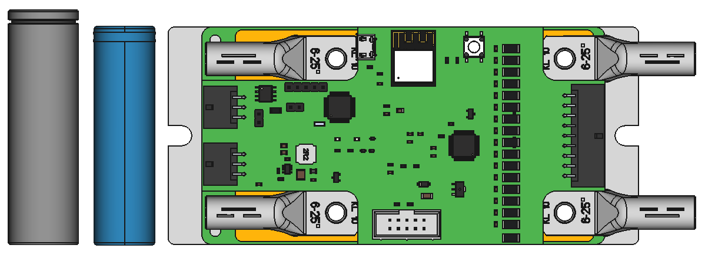
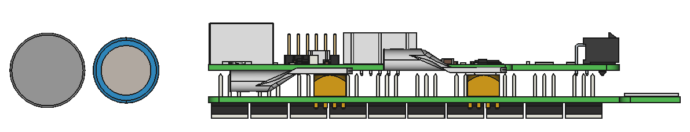

# BMS 16S100 SC

 Very early and incomplete development stage.

This repository contains the files for ongoing development of the Libre Solar BMS 16S100 SC.

The project is funded by the [EnAccess foundation](https://enaccess.org).

Technical specification: [libre.solar/bms-16s100-sc/spec/](https://libre.solar/bms-16s100-sc/spec/) (work in progress)

## Work in progress

The KiCad files are work-in-progress. Have a look only if you are interested in preliminary details of the ongoing development.

Below images show the concept of the BMS with two stacked boards (power and control).

## Features

- 3 to 16 Li-ion cells in series (using bq76952)
- Integrated high-side MOSFET switch and current sensor
- STM32G0B1 or ESP32 microcontroller
- Support for different cell chemistries including LiFePO4 and NMC
- Built-in CAN communication interface and UEXT extension connector

## Firmware

The firmware is developed in a separate repository [LibreSolar/bms-firmware](https://github.com/LibreSolar/bms-firmware).

## License

The hardware is licensed under the [CERN Open Hardware Licence Version 2 - Weakly Reciprocal](LICENCE).

Documentation is licensed under the [Creative Commons Attribution-ShareAlike 4.0 International (CC BY-SA 4.0) License](https://creativecommons.org/licenses/by-sa/4.0/).
