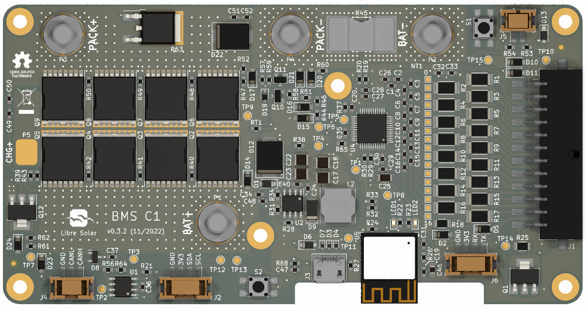

# Libre Solar BMS C1

 Prototype built, development ongoing (some issues might still be open).

This repository contains the files for ongoing development of the Libre Solar BMS C1.

**Remark:** This BMS was previously named **BMS 16S100 SC**. It was renamed to C1 (with C for compact/centralized) because the maximum current and supported number of cells depend on the parts actually populated on the PCB, so these specs should not be encoded in the PCB name.

The development of this BMS is funded by the [EnAccess foundation](https://enaccess.org).

Schematic: [PDF file](build/bms-c1.pdf)

Bill of Materials: [CSV file](build/bms-c1_bom.csv) or [interactive HTML BOM](https://libre.solar/bms-c1/bms-c1_ibom.html)

Firmware repository: [LibreSolar/bms-firmware](https://github.com/LibreSolar/bms-firmware)

## Features

- 3 to 16 Li-ion cells in series
- Continuous current: 70-100A (depending on used MOSFETs and heat sink)
- Cell types: LiFePO4, Li-ion NMC and others (customizable)
- Measurements
  - Cell voltages
  - Pack voltage
  - Pack current
  - Pack (2x) and MOSFET temperatures
- Based on Texas Instruments bq76952
- Integrated high-side MOSFET switch and current sensor
- Espressif ESP32-C3 microcontroller
- Communication interfaces:
  - CAN
  - USB (CDC-ACM and JTAG)
  - USART
  - I2C
  - Bluetooth Low Energy
  - WiFi
- Hardware features
  - 4-layer PCB
  - M5 screw terminals
  - Heat sink at back side
- Applications
  - Off-grid storage
  - Light-electric vehicles (LEV)

## Firmware

The firmware is developed in a separate repository [LibreSolar/bms-firmware](https://github.com/LibreSolar/bms-firmware).

## License

The hardware is licensed under the [CERN Open Hardware Licence Version 2 - Weakly Reciprocal](LICENCE).

Documentation is licensed under the [Creative Commons Attribution-ShareAlike 4.0 International (CC BY-SA 4.0) License](https://creativecommons.org/licenses/by-sa/4.0/).
