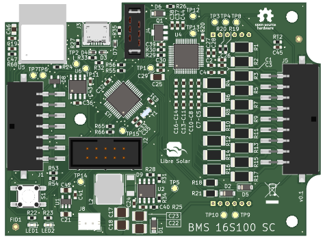
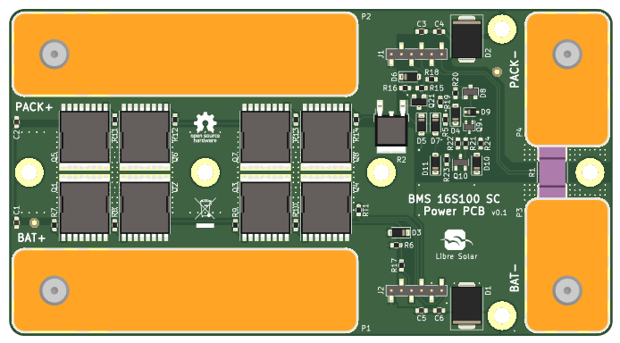

# BMS 16S100 SC

 Very early development stage.

This repository contains the files for ongoing development of the Libre Solar BMS 16S100 SC.

The project is funded by the [EnAccess foundation](https://enaccess.org).

Technical specification: [libre.solar/bms-16s100-sc/spec/](https://libre.solar/bms-16s100-sc/spec/) (work in progress)

## Design files

The first v0.1 design of the boards is ready for review. The PCBs will be ordered to build a first prototype.

Schematic (PDF file): [Control PCB](build/bms-control-16s.pdf) / [Power PCB](build/bms-power-100a.pdf)

Bill of Materials (CSV file): [Control PCB](build/bms-control-16s_bom.csv) / [Power PCB](build/bms-power-100a_bom.csv)

Interactive board and BOM (HTML): [Control PCB](https://libre.solar/bms-16s100-sc/bms-control-16s_ibom.html) / [Power PCB](https://libre.solar/bms-16s100-sc/bms-power-100a_ibom.html)

Below images show the two stacked boards (power and control) of the BMS.

## Features

- 3 to 16 Li-ion cells in series (using bq76952)
- Integrated high-side MOSFET switch and current sensor
- STM32G0B1 or ESP32-C3 microcontroller
- Support for different cell chemistries including LiFePO4 and NMC
- Built-in CAN communication interface and UEXT extension connector

## Firmware

The firmware is developed in a separate repository [LibreSolar/bms-firmware](https://github.com/LibreSolar/bms-firmware).

## License

The hardware is licensed under the [CERN Open Hardware Licence Version 2 - Weakly Reciprocal](LICENCE).

Documentation is licensed under the [Creative Commons Attribution-ShareAlike 4.0 International (CC BY-SA 4.0) License](https://creativecommons.org/licenses/by-sa/4.0/).
