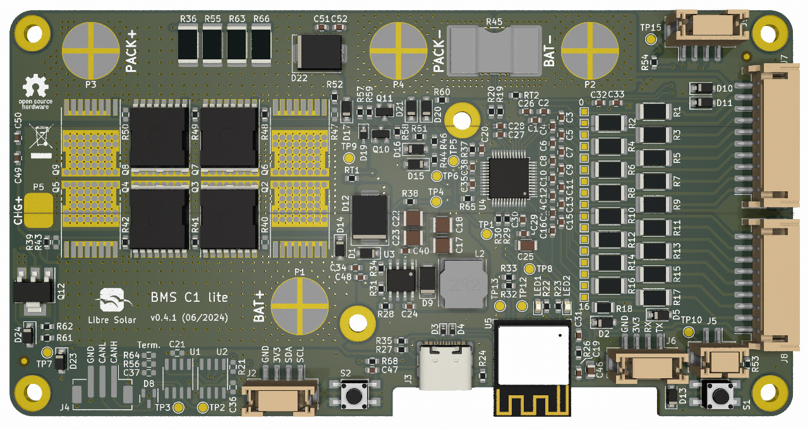

# Libre Solar BMS C1 lite

 Tested prototype, only minor issues left.

This branch contains all required files for the cost-optimized Libre Solar BMS C1 **lite**. The **full** version of the BMS can be found in the [main branch](https://github.com/LibreSolar/bms-c1) of this repository.

**Remark:** This BMS was previously named **BMS 16S100 SC**. It was renamed to C1 (with C for compact/centralized) because the maximum current and supported number of cells depend on the parts actually populated on the PCB, so these specs should not be encoded in the PCB name.

The development of this BMS is funded by the [EnAccess foundation](https://enaccess.org).

Schematic: [PDF file](build/bms-c1.pdf)

Bill of Materials: [CSV file](build/bms-c1_bom.csv)

Firmware repository: [LibreSolar/bms-firmware](https://github.com/LibreSolar/bms-firmware)

User manual (for non-lite version): [libre.solar/bms-c1/manual/](https://libre.solar/bms-c1/manual/)

Mechanical CAD file: [bms-c1.FCStd](housing/bms-c1.FCStd)

Mechanical BOM: [bms-c1_bom_mechanical.csv](housing/bms-c1_bom_mechanical.csv)

Heat sink drawings: [10003_BackPlateAsm.pdf](housing/10003_BackPlateAsm.pdf)

Test report: [testing/v0.3](testing/v0.3/README.md)

## Features

The main difference compared to full-featured version of the BMS is the reduced number of MOSFETs, removed CAN and RS-485 communication interfaces, cheaper cell connectors (JST PH) and solder-pads instead of SMT screw terminals.

- 3 to 16 Li-ion cells in series
- Continuous current: ~~70-100A~~ 50-70A (depending on used MOSFETs and heat sink)
- Cell types: LiFePO4, Li-ion NMC and others (customizable)
- Measurements
  - Cell voltages
  - Pack voltage
  - Pack current
  - Pack (2x), MOSFET and shunt temperatures
- Based on Texas Instruments bq76952
- Integrated high-side MOSFET switch and current sensor
- Espressif ESP32-C3 microcontroller
- Communication interfaces:
  - ~~CAN~~
  - ~~RS-485 (connector shared with CAN)~~
  - USB (CDC-ACM and JTAG)
  - USART
  - I2C
  - Bluetooth Low Energy
  - WiFi
- Hardware features
  - 4-layer PCB
  - ~~M5 screw terminals~~ Solder pads for high-current connections
  - Heat sink at back side
- Applications
  - Off-grid storage
  - Light-electric vehicles (LEV)

## Firmware

The firmware is developed in a separate repository [LibreSolar/bms-firmware](https://github.com/LibreSolar/bms-firmware).

## License

The hardware is licensed under the [CERN Open Hardware Licence Version 2 - Weakly Reciprocal](LICENCE).

Documentation is licensed under the [Creative Commons Attribution-ShareAlike 4.0 International (CC BY-SA 4.0) License](https://creativecommons.org/licenses/by-sa/4.0/).
