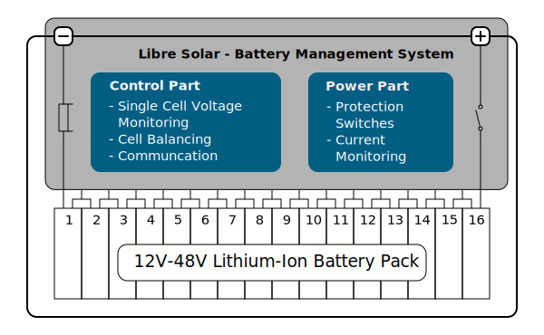

# Introduction

This technical specification describes the functions and requirements for a flexible open-source Battery Management System (BMS) suitable for various applications.

## Project background

The main target of the project behind this BMS is to provide a solid technical basis for custom developments of organizations working in the energy access sector.

The project is funded by the [EnAccess Foundation](https://enaccess.org/).

The development is driven by the Libre Solar and EnAccess Communities. Visit the following websites for most recent updates:

- EnAccess Community: [community.enaccess.org](https://community.enaccess.org/)

- Libre Solar Community: [talk.libre.solar](https://talk.libre.solar/)

Hardware and firmware source files are published on GitHub:

- Hardware Repository: [github.com/LibreSolar/bms-16s100-sc](https://github.com/LibreSolar/bms-16s100-sc)

- Firmware Repository: [github.com/LibreSolar/bms-firmware](https://github.com/LibreSolar/bms-firmware)

## System overview

The BMS is the heart of every Li-ion battery. It is needed to equalize series connected cells and protect the battery from current, voltages and temperatures outside the allowed operating range.

Below figure shows a complete battery system with the integrated BMS. The BMS electronics are split into two separate boards, one for signal processing and control, the other one for high currents (power board).

This BMS will have the following high-level features:

- Flexible and fully open-source design
- Suitable for 12V, 24V or 48V systems (up to 16 cells in series)
- Continuous currents of up to 100A

With above specifications it will be suitable for for the following applications:

- Poductive use appliances like milling machines
- Energy storage for AC mini-grid applications with up to 4 kVA inverters
- Second-life batteries built e.g. from recycled EV batteries

## Disclaimer

This specification has been written and checked with care and to the best of our knowledge.

Libre Solar assumes no liability for the accuracy, completeness or quality of the information provided. Liability claims against the team for material, physical or immaterial damages caused by the use or non-use of the information provided or by the use of incorrect and/or incomplete information are excluded.

All information and instructions are non-binding. Libre Solar reserves the right to change, supplement or delete parts of the pages or the entire document without prior notice.

## License

This specification document is licensed under the Creative Commons Attribution-ShareAlike 4.0 International (CC BY-SA 4.0) License.

The full license text is available at [https://creativecommons.org/licenses/by-sa/4.0/](https://creativecommons.org/licenses/by-sa/4.0/).
