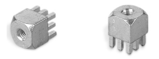
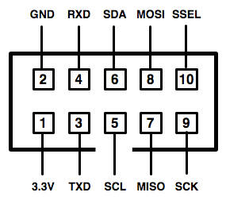

# Requirements

## Mechanical Design

As the BMS boards will be integrated into a battery system with its own enclosure, it does not require a fully protected enclosure itself.

The BMS plastic enclosure must protect the circuit during assembly (e.g. against short circuits by tools) and to allow fixation inside the battery.

The MOSFET switches require cooling through an aluminum heat sink, which will be integrated into the design.

Wires of up to 35 mm² cross-section must be supported by the terminals.

### Outside dimensions and shape

The height is the same as typical 18650 cells so that it can be easily integrated into existing housings.

The larger cell depicted at the left side is a 2170-type cell, which has a height of 70 mm instead of 65 mm.

## Electronics Hardware

### Board split

The electronics circuits should be split into 3 parts:

- Control PCB
  - Microcontroller
  - BMS ASIC
  - Internal power supply
  - Communication interfaces (CAN and UEXT)
- Power PCB
  - High current terminals
  - MOSFETs (approx. 10 in parallel)
  - Current measurement shunt
- Active Balancing PCB (optional, not part of this project)
  - Circuitry required for active balancing
  - Potentially additional microcontroller

### MCU selection

It is planned to support two different MCUs on the board in order to avoid chip supply shortage problems. The main MCU will be from the STM32G0B1 series. The alternative will be from the ESP32 series.

As the available space for the MCUs is very tight, the alternative MCU may have to be mounted to the bottom side of the PCB, even though all other parts can hopefully be placed from a single side only.

The STM32 series is very well supported by Zephyr RTOS. For the ESP32 series, some peripherals like CAN bus don't work out of the box, yet, as the drivers are not yet ported. The support for ESP32 is expected to improve significantly till the end of the project.

#### Considered alternatives

Nordic nRF52840, but does not have CAN and WiFi compared to ESP32.

### ASIC selection

Texas Instruments **bq76952**

**Pro:** Good compromise between accuracy, features and cost.

Features according to Datasheet:

- Battery monitoring capability for 3-series to 16-series cells
- Integrated charge pump for high-side NFET protection with optional autonomous recovery
- Extensive protection suite including voltage, temperature, current, and internal diagnostics
- Two independent ADCs
- Support for simultaneous current and voltage sampling
- High-accuracy coulomb counter with input offset error < 1 uV (typical)
- High accuracy cell voltage measurement < 10 mV (typical)
- Wide-range current applications (±200-mV measurement range across sense resistor)
- Integrated secondary chemical fuse drive protection
- Autonomous or host-controlled cell balancing
- Multiple power modes (typical battery pack operating range conditions)
- NORMAL mode: 286 uA
- Multiple SLEEP mode options: 24 uA to 41 uA
- Multiple DEEPSLEEP mode options: 9 uA to 10 uA
- SHUTDOWN mode: 1 uA
- High-voltage tolerance of 85 V on cell connect and select additional pins
- Tolerant of random cell attach sequence on production line
- Support for temperature sensing using internal sensor and up to nine external thermistors
- Integrated one-time-programmable (OTP) memory programmable by customers on production line
- Communication options include 400-kHz I2C, SPI, and HDQ one-wire interface
- Dual-programmable LDOs for external system usage
- 48-pin TQFP package (PFB)

#### Considered alternatives

Analog Devices **ADBMS1818** (compatible to LTC68xx series)

**Cons:**

- Significantly more expensive than bq76952 (approx. 3 times more)
- No integrated pack-level protection (intended for modular high-voltage BMS)

Features according to Datasheet:

- Measures up to 18 battery cells in series
- 3.0 mV maximum total measurement error
- Stackable architecture for high voltage systems Built-in isoSPI™ interface
- 1 Mb isolated serial communications
- Uses a single twisted pair, up to 100 meters
- Low EMI susceptibility and emissions
- Bidirectional for broken wire protection
- 290 us to measure all cells in a system
- Synchronized voltage and current measurement
- 16-bit delta-sigma ADC with programmable third-order noise filter
- Passive cell balancing up to 200 mA (maximum) with programmable pulse‑width modulation
- 9 general purpose digital I/O or analog inputs
- Temperature or other sensor inputs
- Configurable as an I2C or SPI master
- 6 uA sleep mode supply current
- 64-lead eLQFP package

### Balancing

The BMS shall have passive balancing with the maximum current supported by the ASIC.

An additional pin header with connections to each cell will be provided so that an additional board containing active balancing circuitry can be added in the future. In addition to that, an I2C bus will be exposed to the pin header for potential communication between the main MCU and a "smart" active balancing board.

#### Considered alternatives

The below mentioned active balancing solutions were considered, but not actually implemented in the design.

For a good overview of different balancing technologies the paper [A Review of Passive and Active Battery Balancing based on MATLAB/Simulink by M. Daowd et al.](https://www.researchgate.net/publication/231169729_A_Review_of_Passive_and_Active_Battery_Balancing_based_on_MATLABSimulink) is highly recommended.

Solutions based on the ETA3000 or a switched capacitor are potentially very cheap options. However, the required components are currently not readily available. Solutions based on ICs of well-known manufacturers like Texas Instruments and Analog Devices / Linear Technologies are very expensive and for this reason not considered to be included by default in this BMS targeting cost-sensitive applications.

##### ETA3000

The ETA3000 is an integrated circuit that implements switched inductor balancing with up to 2A. A 16s pack requires 15 ETA3000 chips, 15 inductors and a few additional resistors and MLCCs.

Each chip measures the voltage of two adjacent cells and moves charge from the cell with higher cell voltage to the one with lower voltage. The balancing starts at voltage differences of more than 100 mV and stops at around 30 mV. This makes it a potentially suitable companion to the passive balancing provided by the bq75952. The chip does not need any communication with the microcontroller.

A disadvantage of this solution is that tolerances in each chip add up, so that the actual difference between the lowest and highest cell can be more than 30 mV for a large number of series connected cells.

This chip is used in multiple active balancers sold on Aliexpress, but it does not seem to be available on the general market. It is not listed by any of the US distributors or LCSC, for example.

See also [this blog post](https://www.beyondlogic.org/review-li-ion-lipo-lifepo4-lithium-battery-active-equalizer-balancer-energy-transfer-board/) for further details.

##### Switched capacitor

Similar to the ETA3000 chip, energy can also be transferred between two cells using switched capacitors instead of an inductor. This principle is used by other popular active balancers available on Aliexpress, e.g. by the manufacturer [Heltec BMS](https://heltec-bms.com/products/active-balancer/).

Unfortunately, the used chips (SOIC-8 package) in those BMSs do not have any marking. No suitable chip made by well-known manufacturers was found during the research for this project.

##### Analog Devices LTC3300-1

One chip can balance up to 6 series-connected cells, which means that 3 chips are needed for the 16s pack.

The lowest price per chip from distributors is around $7.50 for an order of 1000 pcs (as of 11/2021).

##### Texas Instruments EMB1428Q

The lowest price per chip from distributors is around $9.50 for an order of 1000 pcs (as of 11/2021).

### Protective switches

The positive battery terminal can be disconnected by the BMS for safety reasons or upon demand of the user via a communicatoin interface.

The disconnect switch will be built using N-channel MOSFETs a back-to-back configuration to be able to interrupt current in both directions (see also bq76952 datasheet). In order to allow the high currents, multiple MOSFETs will be connected in parallel (estimation: up to 10 MOSFETs in TO-220 package in parallel).

The MOSFETs can be screwed to a heat sink to dissipate the heat at high continuous currents.

#### Considered alternatives

A different option for the disconnect switch would be the use of contactors. However, they are usually more expensive and require more space. 48V and 100A is still considered feasible with MOSFETs.

### Current measurement

The current will be measured using a shunt, located in the negative voltage path of the battery pack. The shunt voltage will be amplified by the bq76952 ASIC and read by the MCU.

Time-critical safety features like overcurrent and short circuit protection are implemented directly in the ASIC and can be calibrated via firmware.

Suggested part: [Vishay WSMS5512 series](https://www.vishay.com/docs/30135/wsms5515.pdf)

The part can be mounted directly to the PCB using soldering pins or screws.

**Attention:** This part is a single-sourcing option. No other manufacturer with a part with similar specifications and dimensions could be found so far.

#### Considered alternatives

The shunt resistor could be placed outside the BMS with the two measurement wires connected to the BMS for reading the shunt voltage. This solution is currently not considered, as it requires more space and is more susceptible to noise because of a longer measurement wire.

### Cell and thermistor connectors

The cells will be connected to the BMS control PCB using [Molex Micro-Fit](https://www.molex.com/molex/products/family/microfit_30) or [Würth WR-MPC3](https://www.we-online.com/katalog/en/em/connectors/wire-to-board/wr_mpc3) series connectors, as shown in the following image.

Both series are pin-compatible and there are even more compatible connectors in the market for this popular series. The connectors can handle up to 5A, which is sufficient even for active balancing.

#### Considered alternatives

BMS boards available on eBay or AliExpress often use connectors similar to JST PH or XH series. However, these connectors are only suitable for lower balancing currents and the quality of cables and connectors on eBay is not reproducible. Above mentioned connectors from Molex or Würth are considered more reliable.

### Power connectors

The BMS will be designed for up to 100A continuous current. As the MOSFETs are soldered to the power PCB, the current has to go through the PCB. The connection from wire to board is critical and must handle the required current reliably.

High-current wire-to-board connector is rather expensive. As a good compromise regarding price, flexibility and packaging volume the currently suggested connection technology is:

1. Two 9x9 mm Würth WP-BUCF press-fit terminals in parallel, each handling 50 A. The wire can be connected using crimped ring terminals and M5 screws.
2. Solder-pad next to the terminals for direct soldering of the wires to the PCB.

The following image shows an example of the terminals.

The terminals require an additional assembly step after soldering. However, similar connectors with through-hole reflow assembly methods have proven to be very difficult to solder together with smaller components on the same PCB because auf their high thermal mass. It makes sense to add the terminals in a separate step.

As the cheapest solution, the terminals can be omitted and the wires can be soldered directly to the PCB. This solution is not considered as reliable, especially if the board can be exposed to vibrations.

### Power PCB specifications

The current plan is to manufacture the power PCB (for 100A) as a 4-layer PCB with outer layers of 105 µm copper thickness. Technologies like thick copper inlays should be avoided in order to reduce cost, if possible.

Whether 105 µm copper is sufficient is yet to be tested with first prototypes.

### Communication interfaces

One major advantage of an open source design is its extensibility and adaptation to specific requirements.

In order to provide the hardware interfaces required to add custom extensions, two options are offered. Communication between multiple BMSs or other devices like charge controllers can be achieved via CAN bus, while the UEXT connector allows to add communication modules (e.g. GSM, LoRa) that directly inteface with the MCU's I2C, SPI or UART peripherals.

#### CAN bus

The connector is a standard RJ45 jack as used for Ethernet. Also the same wires (Cat. 5e twisted pair or better) are used, allowing reliable communication with easily available parts.

The pinout of the connector is similar to the CANopen specification:

| Pin # | Name  | Description |
|-------|-------|-------------|
| 1     | CAN_H | CAN bus high signal |
| 2     | CAN_L | CAN bus low signal |
| 3     | GND   | CAN and power supply GND (optional) |
| 4     | V+    | Bus power supply (optional, 12-24V nominal) |
| 5     | V+    | Bus power supply (optional, 12-24V nominal) |
| 6     | -     | reserved (do not connect) |
| 7     | GND   | CAN and power supply GND (optional) |
| 8     | (V+)  | Unconnected by default, optional jumper to V+ |

The pinout specification aims to create as little interference with existing standards as possible. Most important, any damage must be prevented if a LS.bus device is accidentally connected to a standard Ethernet jack.

In contrast to the CANopen specification, pin 8 is not used as the bus power supply (V+). 10/100 MBit Ethernet jacks with integrated magnetics (e.g. [these ones](https://katalog.we-online.de/pbs/download/Tutorials_Connecting+LAN+Transformers_EN+%28rev1%29.pdf)) internally connect pin 4 to 5 and pin 7 to 8. In addition to that, Power over Ethernet (PoE) uses pins 4+5 for positive power rail and pins 7+8 for GND. So it's not ideal to use pin 7 as GND and pin 8 as V+.

The CAN bus will **not** provide galvanic isolation. The additional cost is not justified, as all other components will be connected to the battery via thick wires and CAN can handle significant ground offsets.

One board has 2 RJ45 jacks for daisy-chaining and maintaining the bus topology. The endpoints have to be terminated with termination plugs or or via a jumper on the board.

The BMS will not use the power supply pins, as its voltage can exceed nominal 24V. The CAN interface will only be used for communication.

#### UEXT connector

The Universal Extension Connector is a 10-pin connector featuring most important microcontroller interfaces I2C, UART and SPI. With the integrated 3V3 power supply, it can be used to connect different communication modules to a given device.

All Libre Solar devices are equipped with a UEXT connector.

Several UEXT modules are available at [Olimex](https://www.olimex.com/Products/Modules/UEXT/), the inventor of the UEXT standard.

## Firmware Features

The firmware for the BMS will be developed based on existing [Libre Solar BMS firmware](https://github.com/LibreSolar/bms-firmware), which supports only BMS ASICs with lower cell count at the time of starting this project.

The firmware is based on [Zephyr RTOS](https://www.zephyrproject.org/) and thus allows for easy integration of additional communication features. The latest Zephyr long-term support release is in the process of being certified for functional safety according to IEC 61508.

Amongst all features inherited from underlying Zephyr, the BMS firmware will have the additional BMS-specific features:

- Monitoring and configuration using the [ThingSet](https://thingset.io/) protocol (mapping to MQTT, CoAP and HTTP possible)
  - Serial interface
  - CAN bus
- Extensions via [UEXT connector](https://en.wikipedia.org/wiki/UEXT) possible
  - I2C
  - SPI
  - UART
- SOC estimation based on coulomb counting
- Configuration options
  - Pack layout
    - Cell chemistry (LiFePO4, NMC, NCA)
    - Nominal capacity
    - Number of cells
    - Thermistor type
    - Shunt resistor
    - Custom open circuit voltage (OCV) look-up table
  - Protection
    - Discharge short circuit limit (A)
    - Discharge short circuit delay (us)
    - Discharge over-current limit (A)
    - Discharge over-current delay (ms)
    - Charge over-current limit (A)
    - Charge over-current delay (ms)
    - Cell target charge voltage (V)
    - Cell discharge voltage limit (V)
    - Cell over-voltage limit (V)
    - Cell over-voltage error reset threshold (V)
    - Cell over-voltage delay (ms)
    - Cell under-voltage limit (V)
    - Cell under-voltage error reset threshold (V)
    - Cell under-voltage delay (ms)
    - Discharge over-temperature (DOT) limit (°C)
    - Discharge under-temperature (DUT) limit (°C)
    - Charge over-temperature (COT) limit (°C)
    - Charge under-temperature (CUT) limit (°C)
    - Temperature limit hysteresis (°C)
  - Balancing
    - Enable automatic balancing.
    - Balancing cell voltage target difference (V)
    - Minimum cell voltage to start balancing (V)
    - Current threshold to be considered idle (A)
    - Minimum idle duration before balancing (s)
