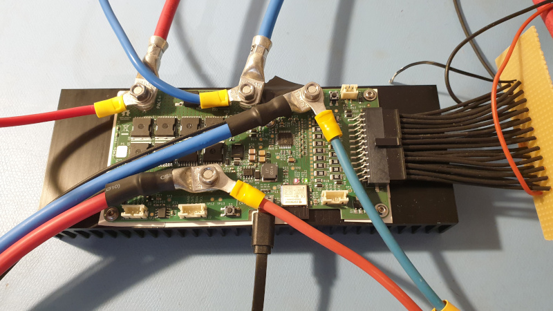
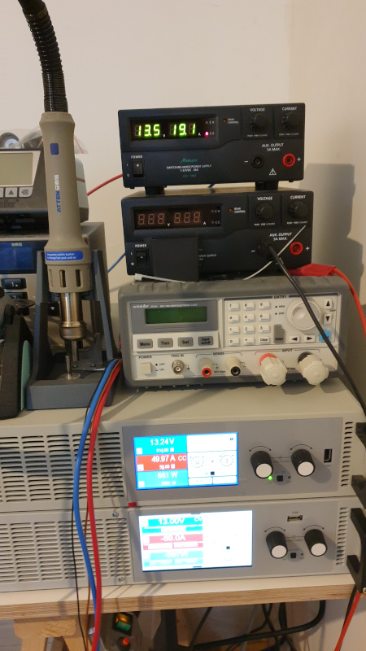
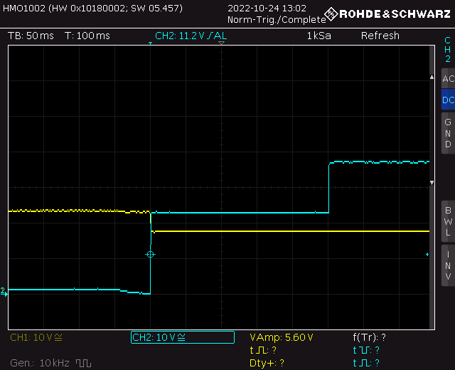
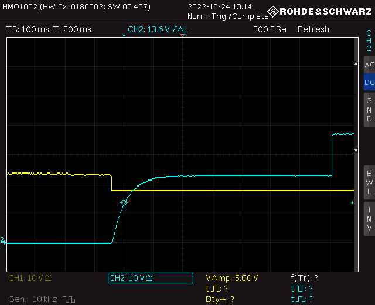
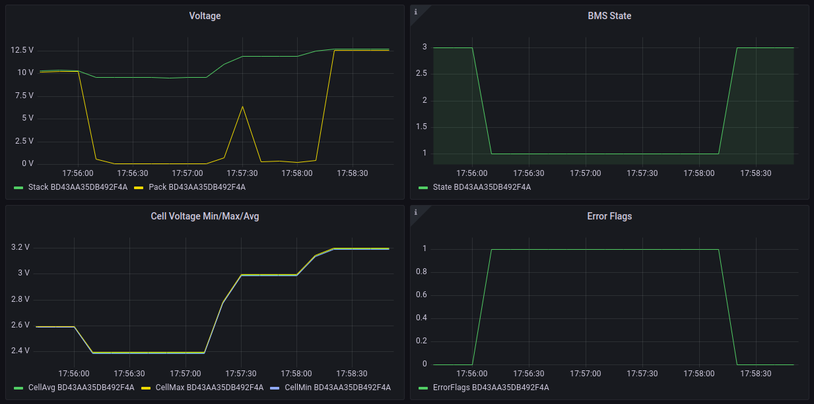
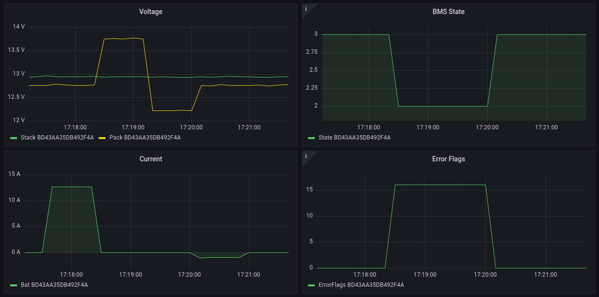
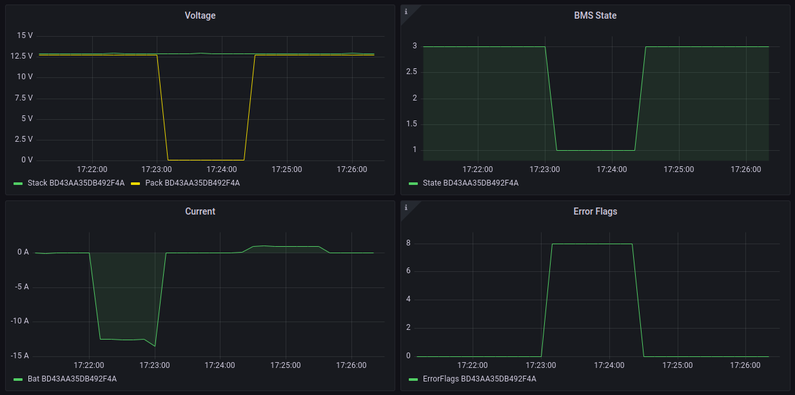
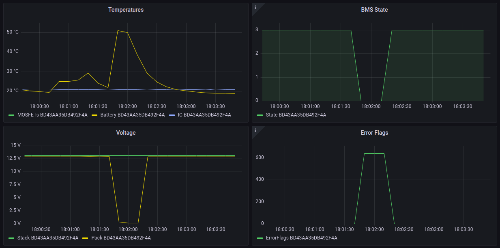
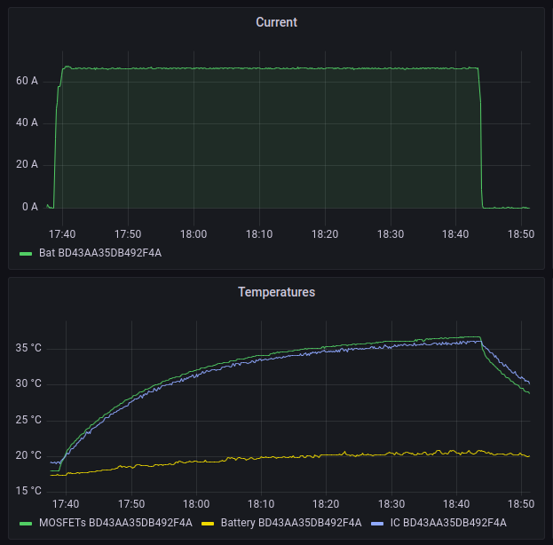
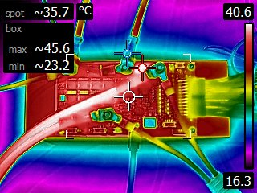

# Test Report

This report describes the tests performed with the Libre Solar BMS C1 v0.3 board released as part of the project funded by EnAccess foundation.

The testing was started with firmware commit [ff09cfe](https://github.com/LibreSolar/bms-firmware/tree/ff09cfed5e36c725bdfe6951e77a32af43480faa).

During testing some bugs were fixed. The final working firmware commit after testing is [408d783](
https://github.com/LibreSolar/bms-firmware/tree/408d783656e0310491120b7033ddef3bc76ef599).

## 1 Test setup and equipment

### 1.1 Test setup

Except for the balancing tests, all tests were performed without an actual battery. Instead, a bi-directional power supply (see below for equipment details) was used to simulate a battery. The cell voltages were generated with a voltage divider network between the positive and negative power supply terminal.

For the performance tests, the BMS was mounted to a heat sink. Other tests without high current requirements were partly done without a heat sink attached.

The below picture shows the setup of the BMS during testing.



### 1.2 Used equipment

The following equipment was used for the tests:

- Elektro-Automatik EA-PSI 9200-50 power supply
- Elektro-Automatik EA-PSB 10080-120 bi-directional power supply
- Fluke 87 V Multimeter
- FLIR E8 thermal camera
- Rohde & Schwarz HMO1002 Oscilloscope
- Linux computer

Below picture shows the different power supplys during the performance test.



## 2 Communication tests

### 2.1 USB serial


#### Device under test (DUT)

Libre Solar BMS C1, v0.3.3, Node ID: D91E6099D8B390DB

#### Requirements

- Serial communication with a host computer must work reliably.
- Flashing new software through the serial port must work.

#### Test description

The BMS was powered up and connected to the host computer with a USB cable. New firmware was flashed to the board. Afterwards ThingSet commands were sent to the device and it was checked if a a valid response was received.

Previous issues with disconnected serial port during Bluetooth operation were resolved in the firmware.

### 2.2 UART serial


#### Device under test (DUT)

Libre Solar BMS C1, v0.3

#### Requirements

- Serial communication with a host computer must work reliably through a USB to serial converter (e.g. FTDI).

#### Test description

The devicetree of the BMS board (`bms_c1.dts`) was adjusted such that the `uart0` is used for ThingSet commnication.

Afterwards, a USB to serial converter was connected to the built-in connector J6 and the communication was tested (both sending and receiving direction).

### 2.3 I2C


#### Device under test (DUT)

Libre Solar BMS C1, v0.3.3, Node ID: D91E6099D8B390DB

#### Requirements

- The BMS communicates successfully with the bq76952 chip.

#### Test description

There were several issues with the Zephyr I2C driver for the ESP32-C3:

1. [Clock stretching not long enough](https://github.com/zephyrproject-rtos/zephyr/issues/51351)

    The bq76952 requires long clock stretching in the I2C communication, which was working fine with STM32 MCUs, but not with the ESP32-C3 driver. The fix was provided to Zephyr upstream, see above issue for links and further details.

2. [Pin glitches during start-up](https://github.com/zephyrproject-rtos/zephyr/issues/51250)

    This issue is still not fixed and the root cause is unknown. However, the BMS makes a second attempt to communicate with the bq76952 chip, which will succeed if the first one failed because of the glitches.

Finally, I2C communication is working reliably.

### 2.4 CAN


#### Device under test (DUT)

Libre Solar BMS C1, v0.3.3, Node ID: BD43AA35DB492F4A

#### Requirements

- The BMS completes the automatic node address assignment process as specified in the ThingSet protocol.
- The BMS sends out live measurement data.

#### Test description

The BMS was connected to a CAN bus and the traffic was logged on a Linux host system.

Output on serial debug console:

```
I: Using CAN node address 0x01
```

Messages on the bus logged on Linux host with `candump`:

```
  can0  1E007101   [5]  FA 41 3C 00 00
  can0  1E007201   [5]  FA 41 3E B8 52
  can0  1E007301   [5]  FA 00 00 00 00
  can0  1E007401   [5]  FA 41 90 66 70
  can0  1E007501   [5]  FA 41 9B 99 A0
  can0  1E007701   [5]  FA 41 92 00 00
  can0  1E007C01   [5]  FA 40 2B 3C E0
  can0  1E007E01   [1]  00
  can0  1E007F01   [1]  03
  can0  1E008001   [6]  90 FA 40 3F 8D 50
  can0  1E008101   [5]  FA 40 3F 81 07
  can0  1E008201   [5]  FA 40 3F 1A A0
  can0  1E008301   [5]  FA 40 3F BE 77
  can0  1E008401   [1]  00
```

## 3 MOSFET circuit tests

### 3.1 Pre-discharge circuit


#### Device under test (DUT)

Libre Solar BMS C1, v0.3

#### Requirements

- The pre-discharge MOSFET should charge the bus through the pre-discharge resistor before switching on the main MOSFETs.

#### Test description

The Oscilloscope was connected as follows:

- Yellow (CH1): PDSG (TP7)
- Blue (CH2): DSG (TP6)

The BMS was switched on twice under different conditions.

1. `BAT+` and `BAT-` terminals open



2. `BAT+` and `BAT-` terminals connected to 1200 µF electrolytic capacitor



As shown in the second oscilloscope shot, if there is a large bus capacitance, the discharge MOSFET gate driver is switched on with a delay and only after the bus voltage has reached the battery pack voltage.

### 3.2 Switching of Power MOSFETs


#### Requirements

- The charge and discharge MOSFETs can be switched on and off individually via ThingSet.

#### Test description

Below operations were performed and the voltages measured with the multimeter.

1. The BMS is put into normal operation.
2. The ThingSet command `=Input {"wChgEnable":false}` is sent to the BMS to switch off the charge path of the MOSFETs.
3. The ThingSet command `=Input {"wChgEnable":true}` is sent to the BMS to switch on the charge path of the MOSFETs again.
4. The ThingSet command `=Input {"wDisEnable":false}` is sent to the BMS to switch off the discharge path of the MOSFETs.
5. The ThingSet command `=Input {"wDisEnable":true}` is sent to the BMS to switch on the discharge path of the MOSFETs again.

#### Test results

The following table shows the measured voltage for the individual steps.

| Step  | BAT+    | CHG+    | PACK+   |
|-------|---------|---------|---------|
| 1     | 11.97 V | 11.97 V | 11.97 V |
| 2     | 11.97 V | 11.71 V | 11.71 V |
| 3     | 11.97 V | 11.97 V | 11.97 V |
| 4     | 11.97 V | 11.97 V |  0.05 V |
| 5     | 11.97 V | 11.97 V | 11.97 V |

Both MOSFETs switch off and on as expected.

### 3.3 Balancing


#### Requirements

- Configured voltage thresholds are considered.
- No adjacent cells are balanced.

#### Test description


The balancing target voltage difference (parameter `Conf/sBalTargetVoltageDiff_V`) is set to 0.01 V (10 mV). Afterwards a battery pack with 8 cells is charged at low rate and the balancing status register is observed.

The `rBalancingStatus` has a value of `162`, which means that cells 2, 6 and 8 (bits 1, 5 and 7) are balanced.

Cell 7 cannot be balanced at the same time as it is adjacent to cells 6 and 8. The algorithm is working correctly.

### 3.4 BMS on/off button / connector


#### Requirements

- A long-press (>3 seconds) switches off the battery.
- A short press for a sleeping battery turns on the battery again.

#### Test description

Long-press the button to switch off the BMS and turn it on afterwards.

The button works as required.

## 4 Protection tests

These tests go beyond the requirements of IEC 62619, which does not contain an undervoltage test.

The following configuration for LFP cells is used for the protection tests (the current thresholds were set to very low limits for testing purposes):

| `Conf` Parameter            | Value |
|-----------------------------|-------|
| `sNominalCapacity_Ah`       | 50.0  |
| `sShortCircuitLimit_A`      | 200.0 |
| `sShortCircuitDelay_us`     | 195   |
| `sDisOvercurrent_A`         | 13.3  |
| `sDisOvercurrentDelay_ms`   | 320   |
| `sChgOvercurrent_A`         | 13.3  |
| `sChgOvercurrentDelay_ms`   | 320   |
| `sDisMaxTemp_degC`          | 45.0  |
| `sDisMinTemp_degC`          | -20.0 |
| `sChgMaxTemp_degC`          | 45.0  |
| `sChgMinTemp_degC`          | 0.0   |
| `sTempLimitHysteresis_degC` | 5.0   |
| `sCellOvervoltage_V`        | 3.8   |
| `sCellOvervoltageReset_V`   | 3.4   |
| `sCellUndervoltage_V`       | 2.5   |
| `sCellUndervoltageReset_V`  | 3.1   |
| `sBalTargetVoltageDiff_V`:  | 0.010 |
| `sBalMinVoltage_V`:         | 3.3   |
| `sBalIdleDelay_s`:          | 1800  |
| `sBalIdleCurrent_A`:        | 0.1   |


### 4.1 Overvoltage protection


#### Requirements

The BMS switches off the charge MOSFET when the overvoltage threshold `Conf/sCellOvervoltage_V` is reached and switches the MOSFET on again after the voltage drops to threshold `Conf/sCellOvervoltageReset_V`.

#### Test description

The voltage at the power supply is increased from 3.3 V to approx. 3.7 V per cell. After a few seconds the voltage is further increased to approx. 3.9 V per cell.

At the end, the voltage is decreased below 3.4 V per cell.


As shown in above picture, the overvoltage is detected correctly and the BMS flags a cell overvoltage error. The charge MOSFET is disabled (state 2).

After reaching voltages below the reset threshold of 3.4 V again, the BMS goes back to normal operation.

### 4.2 Undervoltage protection


#### Requirements

The BMS switches off the discharge MOSFET when the undervoltage threshold `Conf/sCellUndervoltage_V` is reached and switches the MOSFET on again after the voltage rises above threshold `Conf/sCellUndervoltageReset_V`.

#### Test description

The voltage at the power supply is decreased from 2.6 V to approx. 2.4 V per cell.

At the end, the voltage is increased above 3.1 V per cell.



As shown in above picture, the undervoltage is detected correctly and the BMS flags a cell undervoltage error. The discharge MOSFET is disabled (state 1).

After reaching voltages above the reset threshold of 3.1 V again, the BMS goes back to normal operation.

### 4.3 Charge overcurrent protection


#### Requirements

The BMS switches off the charge MOSFET when the charge overcurrent threshold `Conf/sChgOvercurrent_A` is reached and switches the MOSFET on again after the current changes direction.

#### Test description

A power supply is connected to the PACK terminals and provides charging current (positive sign) of around 13 A. After a few seconds, the current is increased to 14 A.

To reset the error, a discharging current of 1 A (negative sign) is applied via an electronic load.



As shown in above picture, the charge overcurrent is detected correctly and the BMS flags a charge overcurrent error (16). The charge MOSFET is disabled (state 2).

After observing the current in the opposite direction, the error is cleared and the BMS goes back to normal operation.

### 4.4 Discharge overcurrent protection


#### Requirements

The BMS switches off the discharge MOSFET when the discharge overcurrent threshold `Conf/sDisOvercurrent_A` is reached and switches the MOSFET on again after the current changes direction.

#### Test description

An electronic load is connected to the PACK terminals and provides discharge current (negative sign) of around 13 A. After a few seconds, the current is increased to 14 A.

To reset the error, a charging current of 1 A (positive sign) is applied via a power supply.



As shown in above picture, the discharge overcurrent is detected correctly and the BMS flags a discharge overcurrent error (8). The discharge MOSFET is disabled (state 1).

After observing the current in the opposite direction, the error is cleared and the BMS goes back to normal operation.

### 4.5 Overtemperature protection


#### Requirements

The BMS switches off the discharge MOSFET when the temperature threshold `Conf/sDisMaxTemp_degC` is reached and switches the MOSFET on again after the tempreature drops below above threshold by `Conf/sTempLimitHysteresis_degC`.

The BMS switches off the charge MOSFET when the temperature threshold `Conf/sChgMaxTemp_degC` is reached and switches the MOSFET on again after the tempreature drops below above threshold by `Conf/sTempLimitHysteresis_degC`.

#### Test description

The cell temperature sensor is heated up with a hot air gun so that it reaches approx. 50 °C. Afterwards the sensor is allowed to cool down to ambient temperature.



As shown in above picture, the overtemperature is detected correctly and the BMS flags a discharge and charge overtemperature (512 + 128). Both MOSFETs are disabled (state 0).

As soon as the temperature drops below the reset threshold, the BMS goes back to normal operation.

## 5 Performance tests

### 5.1 Thermal performance


#### Requirements

The MOSFET and shunt temperatures should stay below 80 °C at 20 °C ambient temperature for the maximum rated current over a period of 60 minutes.

80 °C is a rather conservative requirement which may be adjusted depending on the actual application.

#### Test description

The available test equipment only allowed to sink the maximum rated current of 100 A, but not source the same amount of current. For this reason, the 20 A power supply and the 50 A power supply were connected in parallel.

As the voltages of the small power supply were unstable at 20 A, its current was reduced to 19 A, leading to a total of 69 A provided as charge current through the PACK terminals. The bi-directional power supply was connected to the BAT terminals to sink the same amount of current. The BAT voltage was set to 13 V.

#### Test results

Below graph shows the current profile and temperature rise of the internal sensors over time. The ambient temperature was approx. 18 °C.



Below thermal camera image shows the temperature distribution at the end of the test (after 60 minutes).



As it can be seen, the shunt resistor is the most critical component and rises to 45.6 °C, equivalent to a delta of 27.6 K vs. ambient.

Assuming linear behavior, the expected temperature increase of the shunt resistor for 100 A can be estimated with:

$$
\Delta T_{100A} = \Delta T_{69A} * \frac{100^2}{69^2} = 58 K
$$

This means that the temperature would stay slightly below 80 °C at an ambient temperature of 20 °C.

The MOSFET internal resistance increases with temperature, leading to higher losses at higher temperatures. However, the MOSFET temperatures are only around 40 °C during the test, so there is more margin than for the shunt resistor.

The performance requirements of the BMS are met.
